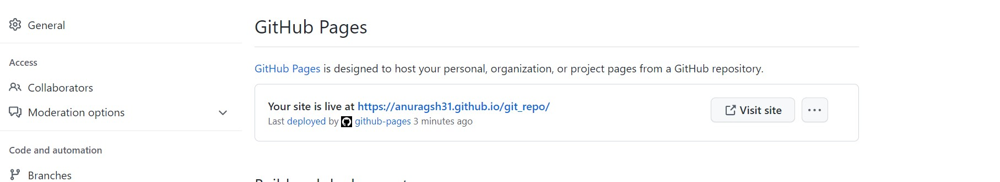

## Task -1

```git config```

This command is used to add the user name and email of thr user 


```git init```

This command is used to initialize git in the folder


```git status```

This command is used to check the status of folder


```git add .```

This command is used to add all the file in staging area


```git commit -m 'comment'```

This command is used to commit the file from staging area


```git remote```

This command is used to create, view, and delete connections to other repositories


``` git push origin main``` 

This command is used to push our commited file in git repository. 


```touch .gitignore```

This command is used to to create new file via git


```git rm -f file```

This command is used to remove the file


```git branch```

This command is used to see all the branch


```git branch feature1```

This command is used to add branch


```git checkout feature1```

This command is used to move to another branch


```git log```

This command is used to see all the commit with comment


```git merage main```

This command is used to merge one branch to another branch


```git show```

Command is used to view expanded details on Git objects.


## Task -2

Here I am adding collaborator


Host GitHub Pages using settings 




## Task -3


